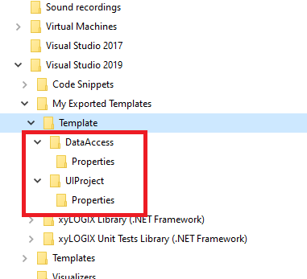

# Selectively generating sub-projects in multi-project templates

## Introduction

The problem that this project solves is related to multi-project templates.

**Problem:** When creating a multi-project template using the Visual Studio **Create new project** dialog box extensibility, out-of-the-box there is no support for toggling on/off which of the sub-projects in the multi-project set you want to create and which you do not.  

Traditionally, when yuo are creating a new [multi-project template](https://docs.microsoft.com/en-us/visualstudio/ide/how-to-create-multi-project-templates?view=vs-2019), it's either all-or-nothing.  We either get all the sub-projects in the template packet added to our solution, or of course, we can choose not to generate anything and then we get nothing.

What if, instead, I could call up a dialog box during the **Create new project** flow, that has check boxes for the-sub projects I want to create?  As in:


**Figure 1.** Toggling which sub-projects I want to create instead of just having to take all of them.

Instead of starting from scratch, I worked off the example shown by Joche Ojeda [in his excellent YouTube tutorial](https://www.youtube.com/watch?v=jUmRUQs2xrs).

In his video, Mr. Ojeda lays out a very simple, two-project system.

Here's its folder structure in File Explorer:



**Figure 2.** Folder structure of the multi-project template in File Explorer.

In this template, we have a dummy Data Access Layer (DAL) and a dummy UI project.  We say "dummy" because the software built from this code does nothing practical.

## Solving the problem: Two Wizard DLLs.

This project contains code for two [Visual Studio template wizards](https://docs.microsoft.com/en-us/visualstudio/extensibility/how-to-use-wizards-with-project-templates?view=vs-2019) for a [multi-project template](https://docs.microsoft.com/en-us/visualstudio/ide/how-to-create-multi-project-templates?view=vs-2019).

There is a `Root` Wizard, and a `Child` Wizard.  The `Root` wizard, as it is aptly named, is launched to display the dialog box that offers the check boxes to the user as to which projects to create.  

Then, the `Child` Wizard is launched by Visual Studio, once for each sub-project, as configured in each sub-project's `.vstemplate` file.

But, wait!  There is another issue: folders. 

As discussed in [this Stack Overflow post](https://stackoverflow.com/questions/3882764/issue-with-visual-studio-template-directory-creation), the directories created by default when a multi-project template is turned into a Solution by the **Create new project** flow in Visual Studio, is that an extra sub-folder of the solution's root directory is created to then contain the folders for the sub-projects.

In that same article, `EliSherer` shared a solution that we ended up using effectively -- after doing lots of logging (code to write logs has been removed, but can be easily replaced because we left the logging functions in place).

## Project components

This project cromprises a `Root` Wizsrd DLL, `MyProjectWizard` and a `Child` Wizard DLL, `ChildWizard`, both implemented as separate C# Class Library (.NET Framework) projects in this solution.

This solution also contains several other C# Class Libraries named `Core.*` where the `*` is a wildcard, that allows the `Root` and `Child` Wizards to share common code.

The `Costura.Fody` NuGet package is used in the `Root` and `Child` Wizards to then weave the references to all other libraries so that the resultant DLLs can be shipped as just two `.dll` files, instead of having to have all the component files shipped as well.

This set of two DLLs gives forkers the capability to:

* Toggle on/off which sub-projects are created and which are not;
* Define wizard-driven, multi-project templates that, after creation, restores the conventional folder structure.

## Toggle Sub-Project Creation On and Off

As shown in **Figure 1**, this project gives us the ability to show a dialog box during project generation that allows the user to select check boxes to turn the generation of individual sub-projects on and off.

So, how do we go about implementing this?

Let's suppose we have a certain multi-project template.  Instead of starting from scratch, I worked off the example shown by Joche Ojeda [in his excellent YouTube tutorial](https://www.youtube.com/watch?v=jUmRUQs2xrs).  

The "root" `.vstemplate` file references `MyProjectWizard` as its `WizardExtension`:

```
<VSTemplate Version="3.0.0" Type="ProjectGroup" xmlns="http://schemas.microsoft.com/developer/vstemplate/2005">
    <TemplateData>
        <Name>Brian Hart Solution Template</Name>
        <Description>A solution template for a Windows application.</Description>
        <ProjectType>CSharp</ProjectType>
        <ProjectSubType></ProjectSubType>
        <SortOrder>1000</SortOrder>
        <CreateNewFolder>false</CreateNewFolder>
        <DefaultName>BrianApplication</DefaultName>
        <ProvideDefaultName>true</ProvideDefaultName>
        <LocationField>Enabled</LocationField>
        <EnableLocationBrowseButton>true</EnableLocationBrowseButton>
        <Iocn>DDD_Solution_icon.png</Iocn>
    </TemplateData>
    <TemplateContent>
        <ProjectCollection>
            <ProjectTemplateLink ProjectName="$safeprojectname$.DAL">
                DataAccess\MyTemplate.vstemplate
            </ProjectTemplateLink>
            <ProjectTemplateLink ProjectName="$safeprojectname$.WindowsApp">
                UIProject\MyTemplate.vstemplate
            </ProjectTemplateLink>
        </ProjectCollection>
    </TemplateContent>
    <WizardExtension>
        <Assembly>MyProjectWizard, Version=1.0.0.0, Culture=neutral, PublicKeyToken=7001bd97f2aab15c</Assembly>
        <FullClassName>MyProjectWizard.WizardImpl</FullClassName>
    </WizardExtension>
</VSTemplate>
```

Each `.vstemplate` file in each sub-project uses `ChildWizard` as its `WizardExtension`:

```
<VSTemplate Version="3.0.0" xmlns="http://schemas.microsoft.com/developer/vstemplate/2005" Type="Project">
  <TemplateData>
    <Name>UIProject</Name>
    <Description>Brian Hart Windows Forms App</Description>
    <ProjectType>CSharp</ProjectType>
    <ProjectSubType>
    </ProjectSubType>
    <SortOrder>1000</SortOrder>
    <CreateNewFolder>false</CreateNewFolder>
    <DefaultName>UIProject</DefaultName>
    <ProvideDefaultName>true</ProvideDefaultName>
    <LocationField>Enabled</LocationField>
    <EnableLocationBrowseButton>true</EnableLocationBrowseButton>
    <Icon>__TemplateIcon.ico</Icon>
  </TemplateData>
  <TemplateContent>
    <Project TargetFileName="UIProject.csproj" File="UIProject.csproj" ReplaceParameters="true">
      <ProjectItem ReplaceParameters="true" TargetFileName="App.config">App.config</ProjectItem>
      <ProjectItem ReplaceParameters="true" TargetFileName="MainWindow.cs">MainWindow.cs</ProjectItem>
      <ProjectItem ReplaceParameters="true" TargetFileName="MainWindow.Designer.cs">MainWindow.Designer.cs</ProjectItem>
      <ProjectItem ReplaceParameters="true" TargetFileName="MainWindow.resx">MainWindow.resx</ProjectItem>
      <ProjectItem ReplaceParameters="true" TargetFileName="Program.cs">Program.cs</ProjectItem>
      <Folder Name="Properties" TargetFolderName="Properties">
        <ProjectItem ReplaceParameters="true" TargetFileName="AssemblyInfo.cs">AssemblyInfo.cs</ProjectItem>
        <ProjectItem ReplaceParameters="true" TargetFileName="Resources.resx">Resources.resx</ProjectItem>
        <ProjectItem ReplaceParameters="true" TargetFileName="Resources.Designer.cs">Resources.Designer.cs</ProjectItem>
        <ProjectItem ReplaceParameters="true" TargetFileName="Settings.settings">Settings.settings</ProjectItem>
        <ProjectItem ReplaceParameters="true" TargetFileName="Settings.Designer.cs">Settings.Designer.cs</ProjectItem>
      </Folder>
    </Project>
  </TemplateContent>
  <WizardExtension>
    <Assembly>ChildWizard, Version=1.0.0.0, Culture=neutral, PublicKeyToken=75d4b77f4e1963de</Assembly>
    <FullClassName>ChildWizard.WizardImpl</FullClassName>
  </WizardExtension>
</VSTemplate>
```

Since the `.vstemplate` files for the two sub-projects are virtually identical, save for name of the project itself, and the `TemplateContent`, we will only show just one of the sub-projects' `.vstemplate` files.

(By the way, how to get the assembly references you ask?  I am not going to belabor those points; see the pre- and post-build events of each project for more details.  Basically, you have to strong-name sign each DLL and install each DLL into the Global Assembly Cache (GAC).)

So, the **Create new project** dialog box in Visual Studio first calls the `WizardImpl` (implementing the `IWizard` interface) class in the `MyProjectWizard` DLL (i.e., the `Root` Wizard).  This displays a dialog box and writes configuration information to a JSON file in a temporary directory.

Then, for each project, the `ChildWizard` DLL's `WizardImpl` class is called, and this class is responsible for loading the configuration, which should encode which projects are turned on and off, and then, if the project that the Wizard is currently being called for is not the project specified by configuration to be created, a `WizardBackoutException` is thrown by the `Child` Wizard.

The `RunFinished` methods in the `WizardImpl` classes, respectively, of the `Root` and `Child` Wizards are responsible to then clean up the folder structure to group the project folders under the same folder level as the `.sln` file is created, per conventions.

## Fixing subfolders

VS 2019 erroneously puts sub-projects as sub-folders of a sub-folder of the Solution folder.  This code, inspired by `EliSherer`'s answer to [this question on Stack Overflow](https://stackoverflow.com/questions/3882764/issue-with-visual-studio-template-directory-creation), fixes that.

The `RunFinished` method of the `Child` Wizard is run when the Visual Studio engine is finished generating a sub-project.

It checks to ensure that the path to the project contains a pattern of the nature `<solution-name>\<solution-name>`, where `<solution-name>` is a placeholder for the name of the containing Solution.

If the pattern is found, then the new project is moved up one level in the file system, and the `EnvDTE` interface provided to the Wizard is then used to remove the project in its old location from the new Solution, and then re-adds the project once it is moved to the new file system location.

Finally, when all the sub-projects are generated, the `RunFinished` method of the `Root` Wizard is called.  This method checks to ensure that the erroneously-created extra sub-folder is empty of any other files and folders.  If it is (which should be the case), then it is erased from the file system.

What should remain are the projects, grouped into their individual, same-named folders under the Solution level, per convention.

## Further work

There is a lot of room for further work in this project, including:

* Make it agnostic to more than one nesting level of solution folder;
* Allow 'presets' in the sub-project selection dialog -- add a drop-down combo box at the top, and depending on which 'preset' is selected, different combinations of sub-project check boxes are turned on or off;
* Allow the set of all eligible presets and sub-projects to be configured not at compile-time but through a JSON input file;
* Make the path to the configuration file editable via the system Registry and/or GUI;
* Bundle this code into a `.VSIX` extension, perhaps with a `Tools -> Options` dialog panel for settings;
* Allow the user to define new custom 'presets'; and
* Read the entire initial configuration for the sub-project selection dialog, presets and all, from the configuration file.

The last three buillets up above are already pretty much able to be implemented using the fact that the configuration is already loaded from a JSON file in a hard-coded location; an exercise for the reader is to add the features listed above --- or, think up others!